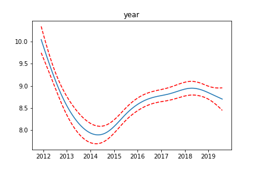
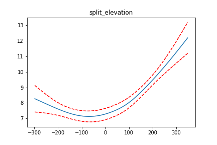

# Strava Analyzer


Strava Analyzer is a web app compiling some of my mid-run, almost-sprained-your-ankle-on-that-curb with a runner's high, weird, workout analysis ideas. It currently utilizes the Strava API and the Dark Sky API and is deployed on AWS Lambda with Zappa.

Try out the current version here: https://pwjwuiuj6i.execute-api.us-east-1.amazonaws.com/dev/


**Current Ideas:**

- [x] Map out all of your previously run Strava workout routes on a single Google map. 

- [ ]  Plot interprettable effects of variables commonly associated with running pace using a [GAM](https://en.wikipedia.org/wiki/Generalized_additive_model).

- [ ] Extended summary statistics


*Work in Progress!!*
*I currently have the GAM output showing smoothed functions of the date, elevation, and temperature. The plots look fairly accurate based on how I feel these three factors affect my pace. More work is needed to make this model more robust to handle any given persons Strava account and not just mine. Another concern is run time; it currently takes a couple of minutes on my local machine to fit(and grid search) the model. Optimizations to limit parameter searches and/or sampling and/or something else will need to be done to ensure a good web experience.*




### Credits/Inspiration:

I got some coding help from this repo.

https://github.com/siquick/mostplayed

The original idea for the mapping came from this existing JS based website.

https://www.jonathanokeeffe.com/strava/map.php


## Installation/Deployment Instructions

**1) Clone the repo**
```
git clone https://github.com/ryanshiroma/strava-analyzer
```

**2) Set up the virtual environment**
```
virtualenv --python=python3.7 env
source env/bin/activate
pip install -r requirements.txt
```

**3) Setup API access accounts**

You'll need to setup accounts with both Google and Strava to access their APIs.
Strava's API is free for use under 600 requests every 15 minutes with a maximum of 30,000 per day.
Google's Maps API is free for the first 28,000 calls per month and $7/1000 calls thereafter. 

Get the Google API key here:
https://developers.google.com/maps/documentation/javascript/get-api-key

and the Strava key here: 
http://developers.strava.com/

**4) Update the config.py file**

Plug in the required Strava and Google Maps API keys into the config.py file
```
client_id = '' # strava client id
client_secret = '' # strava client secret
google_api_key = '' # google maps api key
```

**5) Update the zappa_settings.json file**

Change the `s3_bucket` to to your own unique s3 bucket name. No need to create this bucket, Zappa will automatically create it for you in the next step.

**6) Configure AWS**
In order to delploy to AWS with Zappa, you first need to configure AWS with your AWS account.
```
aws configure
```
Enter your Access Key ID and Secret Access Key from AWS IAM.

**6) Deploy app with Zappa**

Deploy the app to AWS with a name(in this case `dev` but feel free to use whatever name you like):
```
cd app
zappa deploy dev
```
Copy down the deployed app link once the process finishes running.

**7) Update the Strava callback URL**

In order for the Strava authentication to work, you'll need to add the app link to the callback URL on the Strava API site.

https://www.strava.com/settings/api

Under `Authorization Callback Domain`, paste in the deployed app link **domain name only**.

`https://pwjwuiuj6i.execute-api.us-east-1.amazonaws.com/dev/` -> `pwjwuiuj6i.execute-api.us-east-1.amazonaws.com`


**8) Redeploy Updates**
If you make any changes to the code or settings, you can redeploy the app using the existing AWS resources with:
```
zappa update dev
```


